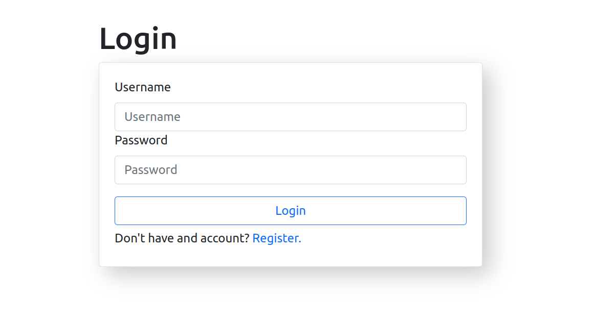
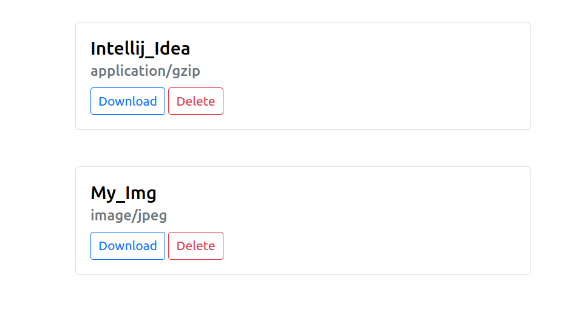
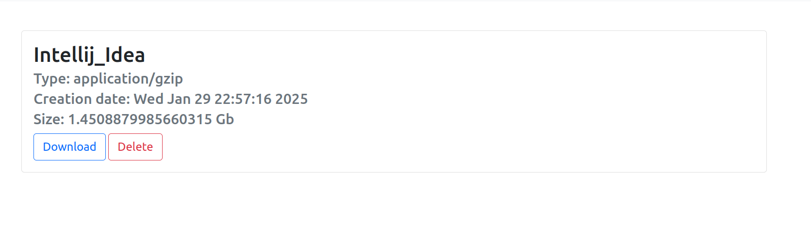
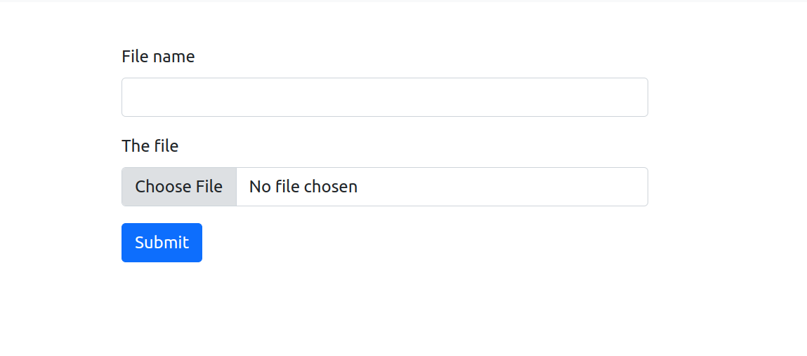

# Archive
This application is a software that you can run on your old laptop or pc to turn it into an archive, I do not advise using it for anything serious.

## Overview
The first thing a user meets is this form the user can choose to either create a user or login into an existing account



Then he'll be redirected into another page, where he can browse the files he already uploaded and download any of them if they choose to do so



The user can also click on the title of a file to see its details



And can upload a file from the upload page which is accessible through the navbar



# Running the project
## Directly
you only need to install the requirements the run the application

```bash
pip install -r requirements.txt
python app.py
```
for debugging

```bash
python app.py debug
```

## Docker
You can build and run the project using the following comands

```bash
docker build . -t archive:v1
docker run -p 80:5000 archive:v1
```
